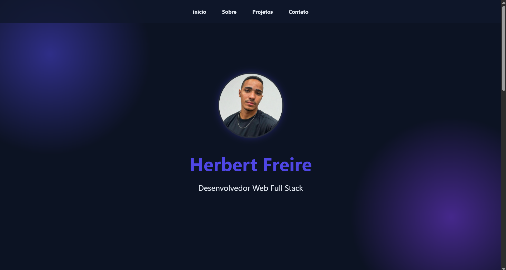

# Portfólio Herbert 💼

**Portfólio pessoal de Herbert Freire — Desenvolvedor Web Full Stack.**
Site estático com exemplos de projetos, bio e formulário para contato via WhatsApp.

---

## 🧭 Conteúdo

- `index.html` — Página principal (início, sobre, projetos, contato)
- `assets/` — `style.css`, `script.js`
- `img/` — fotos e imagens de projeto
- `LICENSE` — MIT License

---

## ▶️ Como visualizar (local)

1. Abra `index.html` no navegador, ou
2. Rode um servidor local (recomendado):
   - Python 3: `python -m http.server 8000` → abra `http://localhost:8000`
   - Ou use a extensão Live Server do VS Code.

---

## ⚡ Deploy (GitHub Pages)

1. No repositório GitHub, vá em **Settings → Pages**.
2. Selecione a branch `main` (ou `gh-pages`) e a pasta `/ (root)` e salve.
3. Aguarde alguns minutos e acesse `https://<seu-usuario>.github.io/<nome-do-repo>`.

Dica: ative `prettier`/CI para garantir que o site publique sempre com código limpo.

---

## 🛠 Tecnologias

- HTML, CSS, JavaScript

---

## ✍️ Contribuições

- Abra uma issue para sugerir mudanças ou melhorias.
- Para contribuir: fork → branch com a feature → PR.

---

## 📸 Pré-visualização

---

## 📝 Licença

MIT — ver `LICENSE`.

---

## 📬 Contato

Email: herbertsantows@gmail.com
Linkedin: linkedin.com/in/herbert-freire
